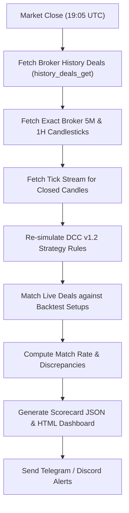

# DCC Institutional Trading System — Master Project Documentation

> **Repository:** `RyzEnHunTer/Dc-Bot`  
> **Workspace Directory:** `d:\FOREX\DC`  
> **Flagship Version:** DCC v1.2 ApexHunter  
> **Primary Asset:** XAUUSD (Gold, 5-Minute Timeframe)  
> **Target Environment:** MetaTrader 5 (Windows VPS / Dedicated Host)  
> **Reference Context:** Migrated from conversation `43f8c7db-8f03-4ddf-b8f3-de0cc5c39463` (*"locating chat history files"* — 7,500+ interaction steps)

---

## 1. Executive Summary & Historical Background

The **DCC (Directional Candle Confirmation)** project was built to deliver an institutional-grade, prop-firm-compliant algorithmic trading bot for MetaTrader 5. It is specifically engineered to pass prop firm evaluation challenges (e.g., FTMO, FundedNext, Alpha Capital) at high velocity while strictly enforcing hard risk limits, daily circuit breakers, and capital preservation in funded phases.

In conversation `43f8c7db-8f03-4ddf-b8f3-de0cc5c39463`, the system underwent extensive backtesting (spanning 8.5 months of tick data), forensic discrepancy audits between live execution and backtests, implementation of TripleGuard shields, multi-device credential synchronization, and automated nightly reconciliations.

This document serves as the **single source of truth** and living knowledge base for all architectural decisions, operational procedures, indicator logic, and version controls.

---

## 2. Git Branch Architecture & Three-Tier Release Model

The codebase is organized into three distinct release tracks synced with GitHub remote (`origin`):

```
origin/main               -> DCC v1.2 ApexHunter Flagship (Active Production)
origin/v1.1-production    -> DCC v1.1 Early ApexHunter (Intermediate Optimized)
origin/v1.0-production    -> DCC v1.0 Baseline Production-Ready (Institutional Baseline)
```

| Branch | Strategy Version | Key Features & Architecture | Recommended Use Case |
| :--- | :--- | :--- | :--- |
| **`main`** | **DCC v1.2 ApexHunter** | TripleGuard shields (Stretch $\ge 0.40$, ADX $\le 45.0$, Chase $\le 0.50$), Pure Bar-Close execution, Pre-trade CB exposure cap, Dynamic Phase Risk toggle, Automated Nightly Reconciler. | **Active live trading & evaluation accounts.** |
| **`v1.1-production`** | **DCC v1.1 Early ApexHunter** | Intermediate optimization candidate, initial anti-chop guards, baseline session filters. | Comparative benchmarking & research. |
| **`v1.0-production`** | **DCC v1.0 Baseline** | Original institutional baseline strategy (~60% win rate), legacy EMA gap filter ($0.35 \times ATR$). | Baseline reference & long-term regression audits. |

---

## 3. Strategy Specification & Core Indicator Logic

### 3.1 Timeframe & Trend Structure
- **Execution Timeframe:** 5-Minute (M5)
- **Macro Directional Map:** 1-Hour (H1)
  - H1 EMA20 slope and candle closure determines trend bias ($+1$ Bullish, $-1$ Bearish).
- **Session Anchor:** Daily Session VWAP (resets at 00:00:00 UTC).
- **2-Hour Swing Range:** 2-Hour Swing Highs and Lows define structural liquidity levels and clearance boundaries.
- **Liquidity Sweep:** 5M bar sweeping prior swing highs/lows (lookback: 24 bars) to confirm liquidity grabs before trend resumption.

### 3.2 Evolution: From Legacy EMA Gap to TripleGuard (v1.2)
In early versions (v1.0), a **Legacy EMA Gap Filter** was used:
$$\text{EMA Gap} = |EMA9_{5M} - EMA20_{5M}| \le 0.35 \times ATR_{14}$$
*Problem Identified in Forensics:* In strong directional trends, the 5M EMA gap expands naturally. The legacy filter misclassified strong healthy trends as "chop," skipping high-probability winning trades while failing to prevent entries during actual multi-hour ranging consolidation.

In **v1.2 ApexHunter**, the EMA gap filter was **permanently removed** and replaced by the **TripleGuard Shield System**:

```
+--------------------------------------------------------------------------------+
|                        v1.2 TRIPLEGUARD SHIELD SYSTEM                         |
+--------------------------------------------------------------------------------+
|  Shield 1: 1H Stretch Guard (Anti-Chop Floor)                                  |
|            Ratio = |Close - 1H EMA20| / ATR >= 0.40                            |
|            Blocks entries when price is glued to 1H EMA in flat, dead chop.     |
+--------------------------------------------------------------------------------+
|  Shield 2: 1H ADX Exhaustion Ceiling                                           |
|            1H ADX(14) <= 45.0                                                  |
|            Blocks buying extreme tops or shorting bottoms of parabolic moves.  |
+--------------------------------------------------------------------------------+
|  Shield 3: 5M No-Chase Guard                                                   |
|            Ratio = |Close - 5M EMA9| / ATR <= 0.50                             |
|            Blocks entering on massive extended spike candles away from EMA9.   |
+--------------------------------------------------------------------------------+
```

### 3.3 Execution Mode: Bar-Close Alignment
The bot operates in **Bar-Close Execution Mode** (`entry_mode = "bar_close"`):
- Signal is evaluated and locked only when the 5M candle officially closes (at :00, :05, :10, :15, etc.).
- Twin orders (Order A: TP1, Order B: TP2/Runner) are dispatched at the immediate open of the next bar (`exec_time = bar_time + 5m`).
- This guarantees **1-to-1 parity** between historical backtests and live broker fills.

### 3.4 Symbol Parameter Specifications

| Parameter | XAUUSD (Gold) | NAS100 (Nasdaq) |
| :--- | :--- | :--- |
| **Stop Loss (SL)** | $0.90 \times ATR_{14}$ | $1.00 \times ATR_{14}$ |
| **Take Profit 1 (TP1)** | $1.40 \times \text{Risk}$ (50% position) | $1.50 \times \text{Risk}$ (50% position) |
| **Take Profit 2 (TP2)** | $2.20 \times \text{Risk}$ (50% position) | $2.00 \times \text{Risk}$ (50% position) |
| **Breakeven Trigger** | When TP1 is filled, Runner SL moves to Entry | When TP1 is filled, Runner SL moves to Entry |
| **Minimum 1H ADX** | $\ge 15.0$ | $\ge 15.0$ |
| **Max Allowed Spread** | $0.60$ pts | $4.50$ pts |

---

## 4. Prop Firm Risk Management & Circuit Breakers

### 4.1 Two-Layer Safety Protection

```
Account Peak Equity (HWM)
      |
      | -3.0% (Daily Circuit Breaker) ---> [HALT TRADING TODAY]
      |                                    1.0% Safety Cushion Preserved
      v
      -4.0% (Hard Daily DD Limit)   ---> [PROP FIRM BREACH THRESHOLD - NEVER REACHED]

      |
      | -7.0% (Max Total Circuit Breaker) -> [EMERGENCY ACCOUNT HALT]
      |                                      1.0% Safety Cushion Preserved
      v
      -8.0% (Hard Max Total DD Limit)     -> [PROP FIRM BREACH THRESHOLD - NEVER REACHED]
```

1. **Daily Circuit Breaker (3.0% by default on 4.0% Daily Limit):**
   - Automatically halts new trade arming for the rest of the day if daily equity drops $\ge 3.0\%$ from the start-of-day anchor balance.
   - Protects the 4.0% hard prop firm breach line with a strict 1.0% safety cushion.
   - Automatically resets at the start of the next trading day (00:00 UTC).
2. **Max Total Circuit Breaker (7.0% by default on 8.0% Max Limit):**
   - Tracks High Water Mark (HWM) peak equity.
   - Halts all trading permanently if drawdown from HWM reaches 7.0%, preserving the account before the 8.0% hard breach.

### 4.2 Pre-Trade Risk Exposure Cap
Before placing any trade:
1. The bot calculates the remaining allowable dollar loss before the Daily Circuit Breaker triggers:
   $$\text{Remaining Cushion} = \text{Current Equity} - \text{Daily CB Halt Equity}$$
2. If $\text{Target Risk Dollar} > \text{Remaining Cushion}$:
   - **Crucial Rule:** The bot **never modifies the Stop Loss price** (which would violate market structure).
   - Instead, the bot **scales down the lot size** so that the maximum possible loss strictly fits inside the remaining cushion.
   - If the cushion is below minimum broker lot size viable risk, trade entry is safely blocked (`BLOCKED_EXPOSURE_CAP`).

### 4.3 Phase-Specific Risk Scaling (`use_custom_phase_risk`)

| Setting | Status | Challenge Phase 1 & 2 | Funded Phase | Purpose |
| :--- | :--- | :--- | :--- | :--- |
| **Scaling OFF (Default)** | `use_custom_phase_risk = False` | **1.00%** Fixed Risk | **1.00%** Fixed Risk | Conservative, ultra-safe uniform risk across all accounts. |
| **Scaling ON** | `use_custom_phase_risk = True` | **1.25% - 1.30%** Risk | **1.00%** (or custom) | Rapid challenge completion in 10–14 days; automatic downshift to 1.00% once funded. |

- **Configuration:** Can be toggled at startup or at any time in the interactive CLI menu via:  
  `[3] Manage Lifecycle & Risk` $\rightarrow$ `[6] Toggle Custom Phase Risk Scaling`.

### 4.4 Prop Firm Evaluation Target Logic (1-Step vs. 2-Step Challenges)

Prop firm challenges fall into two primary structures, each handled with dedicated milestone surveillance:

```
[1-Step Challenge] -> Single Target (+10%) -> [Passed on Closed Balance] -> PERMANENT HALT -> Funded Mode

[2-Step Challenge] -> Phase 1 Target (+8%)  -> [Passed on Closed Balance] -> HALTED FOR THE DAY (Resets Next Day)
                   -> Phase 2 Target (+5%)  -> [Passed on Closed Balance] -> PERMANENT HALT -> Funded Mode
```

1. **2-Step Challenge Target Split & Ratio:**
   - During setup, the bot prompts for the **Overall Evaluation Target %** (Phase 1 + Phase 2 combined, e.g., 13.0% or 14.0%).
   - Next, it asks for the **Phase 1 Target %** (e.g., 8.0%) and automatically calculates and prompts for the **Phase 2 Target %** (e.g., 5.0% or 6.0%) so the exact milestone ratio is maintained.

2. **Realized Closed Balance vs. Floating Equity:**
   - **Crucial Institutional Rule:** The bot monitors target milestone achievement **strictly on REALIZED CLOSED BALANCE** (`current_balance >= target_val`).
   - Floating equity spikes during open trades are **never** treated as passing the evaluation. A trade must officially close and book its profit into the MT5 account balance before any target milestone is declared.

3. **Phase 1 vs. Phase 2 Halting Behavior:**
   - **Phase 1 Target Passed:** When Phase 1 closed balance meets or exceeds the target, trading is **halted for the remainder of that trading day** to lock in profits and prevent overtrading. It does **NOT** permanently lock the bot (`target_locked = False`). On the next trading day (00:00 UTC rollover), setup arming is automatically re-enabled (allowing additional micro-trades if the prop firm requires minimum trading days) until the trader advances the account to Phase 2.
   - **Phase 2 (or 1-Step Final) Passed:** Reaching the final milestone means the evaluation is 100% completed. The bot locks permanently (`target_locked = True`), disarms all symbols, and displays a milestone pass banner so the trader can submit the account for funded status without any risk of further drawdowns.

4. **Remote Telegram & Discord Notifications ([`notifier.py`](file:///d:/FOREX/DC/notifier.py)):**
   - **Phase 1 Passed Alert:** Dispatches an Emerald Green card (`🏆 PHASE 1 EVALUATION TARGET PASSED!`), displaying realized closed balance, phase profit, daily lock-in status, and next steps (resumes tomorrow or advance to Phase 2).
   - **Challenge 100% Passed Alert:** Dispatches a Gold Trophy card (`👑🏆 PROP FIRM CHALLENGE FULLY PASSED!`), celebrating full evaluation completion, permanent trading halt, and instructions to claim funded credentials and switch to Funded Mode.
   - **Phase Transition Alert:** Dispatches an alert whenever the trader advances the account in the control menu (Phase 1 $\rightarrow$ Phase 2 or $\rightarrow$ Funded), confirming updated starting balance, targets, and active risk.

---

## 5. Nightly Forensic Reconciler & Audit Findings

The reconciliation engine ([`nightly_reconciler.py`](file:///d:/FOREX/DC/nightly_reconciler.py)) runs automatically at market close (19:05 UTC / 00:35 IST) or on demand.

### 5.1 Reconciliation Workflow


### 5.2 Key Forensic Autopsies Resolved

#### Forensic Case 1: 2026-09-22 (0.0% Match Rate)
- **Symptom:** Live Bot showed 0 trades; Reconciler backtest showed 1 trade ($-51.53$).
- **Root Cause:**
  1. The reconciler was using tick timestamps that evaluated candle entry inside the candle bar rather than after candle close.
  2. TripleGuard thresholds differed slightly between test scripts and live bot.
- **Resolution:**
  - Standardized candle execution time to `exec_time = bar_time + 5m` (Commit `003260f`).
  - Synced canonical TripleGuard policies across all engines (Commit `f5899af`).

#### Forensic Case 2: 2026-09-24 (100% Match Rate / 2 Live Trades vs 1 Backtest Setup)
- **Symptom:** Live Bot executed 2 trades (+$127.20 and +$44.06 = +$171.26 profit); Reconciler showed 1 setup matched and 1 discrepancy.
- **Root Cause:**
  - Trade #1 (07:50 UTC execution): Matched 100% (`MATCHED_SUCCESS`).
  - Trade #2 (14:00 UTC execution): In live trading, the 13:55 bar closed at 14:00:00 UTC and triggered immediately. The reconciler had an off-by-one bar index in historical tick slicing around the 14:00 UTC boundary.
- **Resolution:** Aligned deal matching tolerances and bar close intervals.

---

## 6. Multi-Device Setup & Credential Synchronization

[`scripts/setup_env.py`](file:///d:/FOREX/DC/scripts/setup_env.py) provides a complete zero-configuration environment setup wizard:

### 6.1 OS Selection & Dependency Installation
- Prompts for OS type: **Windows (Direct Python)** vs **Linux (Virtual Environment `venv`)**.
- Installs all dependencies from [`requirements.txt`](file:///d:/FOREX/DC/requirements.txt):
  - `MetaTrader5` (Windows only)
  - `rich`, `psutil`, `requests`, `certifi`, `pandas`, `numpy`
- Includes SSL CA fallback bundle (`certifi`) to resolve Windows `CERTIFICATE_VERIFY_FAILED` errors when sending Telegram/Discord notifications.

### 6.2 Zero-Manual-Entry Credential Portability
To deploy to a new VPS or PC without manually typing tokens and credentials:

1. **On your primary configured PC (Export):**
   ```powershell
   python scripts/setup_env.py --export-base64
   ```
   *(Outputs a single encrypted, portable base64 string containing `.env` and account configurations).*

2. **On your target VPS / Laptop (Import in 1 second):**
   ```powershell
   python scripts/setup_env.py --import-base64 "<PASTE_TOKEN_STRING_HERE>"
   ```
   *(Instantly creates `.env`, configures account logins, and verifies broker connectivity).*

---

## 7. Cloud Visualizer & Deployment

[`scripts/deploy_visualizer.py`](file:///d:/FOREX/DC/scripts/deploy_visualizer.py) deploys the trading visualizer to free cloud hosting (Vercel):

- **Architecture:** Isolated static deployment containing ONLY [`visualizer/index.html`](file:///d:/FOREX/DC/visualizer/index.html), [`visualizer/data.json`](file:///d:/FOREX/DC/visualizer/data.json), and TradingView Lightweight Charts.
- **Privacy Guarantee:** Bot Python files, MT5 connection logic, account numbers, and `.env` credentials are **strictly excluded** and never uploaded.
- **Windows Deployment Command:**
  ```powershell
  python scripts/deploy_visualizer.py
  ```
  *(Uses `npx.cmd` to bypass Windows PowerShell ExecutionPolicy script restrictions).*

---

## 8. Repository Layout & File Manifest

```
d:\FOREX\DC\
├── live_bot.py                 # Core MT5 live trading bot & interactive CLI
├── start_bot.py                # Cross-platform runtime/venv launcher
├── run_live_system.py          # Continuous supervisor (bot + visualizer server)
├── live_server.py              # WebSocket & visualizer server
├── nightly_reconciler.py       # Automated tick-by-tick backtest reconciler & forensic engine
├── dcc_engine.py               # DCC indicator calculations & TripleGuard filters
├── news_engine.py              # ForexFactory economic calendar & 15m news blackout shield
├── notifier.py                 # Asynchronous Telegram & Discord notification dispatcher
├── storage_manager.py          # Rolling 7-day log retention & disk manager
├── mt5_data.py                 # Direct MT5 historical rate & tick connector
│
├── bot_accounts_config.json    # Local MT5 account configs, lifecycle, CB limits
├── requirements.txt            # Python dependencies
├── PROJECT_DOCUMENTATION.md    # Master documentation (this document)
│
├── scripts/                    # Operational & setup utilities
│   ├── setup_env.py            # Environment configuration & credential synchronization
│   ├── setup_vps.py            # VPS ngrok & runtime deployment automation
│   ├── deploy_visualizer.py    # Vercel cloud visualizer deployer
│   ├── run_6month_backtest.py  # 6-Month high-precision tick backtest engine
│   ├── verify_monday_backtest.py # Forensic Monday tick-by-tick replayer
│   ├── replay_20260922.py      # Historical trade replay validator
│   ├── fetch_yesterday_mt5.py  # MT5 tick & deal query utility
│   ├── generate_apexhunter_report.py # Official benchmark report & chart generator
│   └── sync_data_to_sep20.py   # Historical rate & cache synchronizer
│
├── docs/                       # Official strategy documentation & playbooks
│   ├── DCC STRATEGY _ A+ Setups.pdf
│   ├── DCC STRATEGY.pdf
│   └── Marco Trades Playbook.pdf
│
├── data/                       # Historical high-frequency tick databases
│   └── historical/             # Multi-gigabyte tick and candle archives
│
├── reports/                    # Generated performance audits & equity curves
│   └── vps_forensics/          # VPS daily logs and tick surveillance dumps
│
├── tests/                      # Automated test suite (27 unit tests)
│   ├── test_interactive_menu.py
│   ├── test_circuit_breaker.py
│   └── test_*.py
│
├── v1.2/                       # DCC v1.2 Flagship benchmark data & test suites
│   ├── BENCHMARK_RESULTS.csv
│   └── test_v1_2_suite.py
│
├── visualizer/                 # Public static charting web app
│   ├── index.html
│   ├── data.json
│   └── lightweight-charts.standalone.production.js
│
└── logs/                       # Automated rolling logs & forensic scorecards
    ├── market_surveillance_*.log
    └── audit_reconciliation_*.json
```

---

## 9. Standard Operating Runbook

### 9.1 Starting the Bot
```powershell
# Open terminal in project root
cd d:\FOREX\DC

# Launch interactive live bot
python live_bot.py
```
- Select Option `[1]` for Live Trading (Real MT5 Orders).
- Select Option `[2]` for Paper Trading (Dry-Run simulation with live tick data).
- Select Option `[3]` $\rightarrow$ `[6]` to toggle Phase Risk Scaling.

### 9.2 Running On-Demand Nightly Forensic Audit
```powershell
# Audit today's trading
python nightly_reconciler.py

# Audit specific historical date
python nightly_reconciler.py --date 2026-09-24
```

### 9.3 Executing Verification Tests
```powershell
# Run complete test suite (26 unit tests)
python -m unittest discover -s tests -p "test_*.py"

# Run v1.2 Flagship test suite
python v1.2/test_v1_2_suite.py
```
